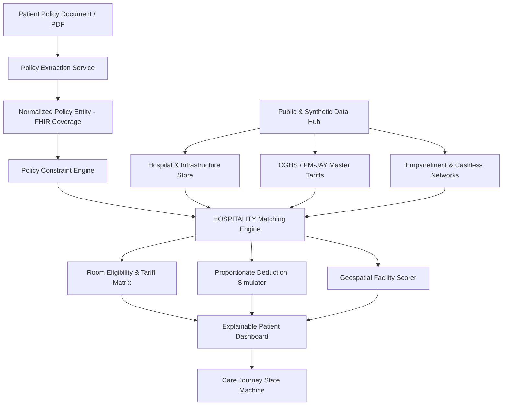

# Master Implementation Plan — HOSPITALITY

**Architecture Version**: 2.0 (Clean Slate Implementation)  
**Standard**: HL7 FHIR R4 / ABDM Digital Health Ecosystem  
**Goal**: Build a production-grade, explainable, India-specific hospital admission & policy navigation decision-support platform.

---

## 🏛️ End-to-End Architectural Flow

---

## 📋 Detailed Execution Phases

### Phase 0: Data-Source Discovery & Clean Foundation
- Catalogue all 30+ potential Indian healthcare data sources.
- Classify sources by availability (`API_AVAILABLE`, `DOWNLOAD_AVAILABLE`, `SANDBOX_AVAILABLE`, `SIMULATED`).
- Formulate the synthetic data generation protocol with clear confidence tagging.

### Phase 1: Canonical Data Model & Database Architecture
- Relational schema covering `hospitals`, `specialties`, `facility_identifiers` (HFR, ROHINI, NIN), `hospital_schemes`, `room_types`, `bed_inventories`, `tariffs`, `policies`, `patient_journeys`, `journey_events`, `data_sources`.
- SQLite for local execution with full PostgreSQL async compatibility via SQLAlchemy 2.0.

### Phase 2: Ingestion & Synthetic Data Engine
- Ingest real data: `data.gov.in` hospital directory sample, `PM-JAY HBP 2022` 1,949 procedure rates, `CGHS` standardized room tariff benchmarks.
- Generate synthetic data: Realistic real-time bed counts, insurer network allocations (Star Health, HDFC ERGO, ICICI Lombard), patient journey event logs.

### Phase 3: AI Policy Intelligence & OCR Engine
- PDF parsing using `pdfplumber` / `PyPDF2`.
- Hybrid extraction: Regex/deterministic heuristic parser + Mock/Gemini LLM engine.
- Structured JSON output with field-level confidence scores, citations, and clause locations.

### Phase 4: Deterministic Policy & Deduction Rule Engine
- Room rent limit evaluation (e.g. 1% of Sum Insured / Single Private A/C cap).
- IRDAI Proportionate Deduction formula calculation:
  $$\text{Deduction Ratio} = \frac{\text{Allowed Room Rent}}{\text{Actual Room Rent}}$$
  $$\text{Payable Associated Charges} = \text{Billed Associated Charges} \times \text{Deduction Ratio}$$
- Co-payment, deductible, and non-payable consumable adjustments.

### Phase 5: Multi-Criteria Facility & Room Matcher
- Radius filtering, empanelment status check (Cashless vs Reimbursement vs Non-network).
- Multi-dimensional ranking (Empanelment score + Out-of-pocket index + Distance + Bed availability).

### Phase 6: REST API Backend (FastAPI)
- Clean, modular API routes: `/api/v1/hospitals`, `/api/v1/policies`, `/api/v1/matching`, `/api/v1/journey`, `/api/v1/data-sources`.
- Complete Pydantic v2 schemas and OpenAPI/Swagger documentation.

### Phase 7: Next.js Interactive Dashboard
- Calm, stress-reducing UI designed for patients and caregivers in emergency/elective admission scenarios.
- Interactive map view, side-by-side hospital comparison, room rent penalty alert modal, care journey milestone tracker.

### Phase 8: Interoperability & FHIR Export
- FHIR R4 `CoverageEligibilityResponse`, `Location`, `Organization`, `Claim` bundle generation.

### Phase 9: Verification, Testing & Demo Scenario
- Automated unit test suite verifying mathematical correctness of all deduction rules.
- 5-Act Ramesh Kumar Bangalore cardiac admission demo walkthrough.
